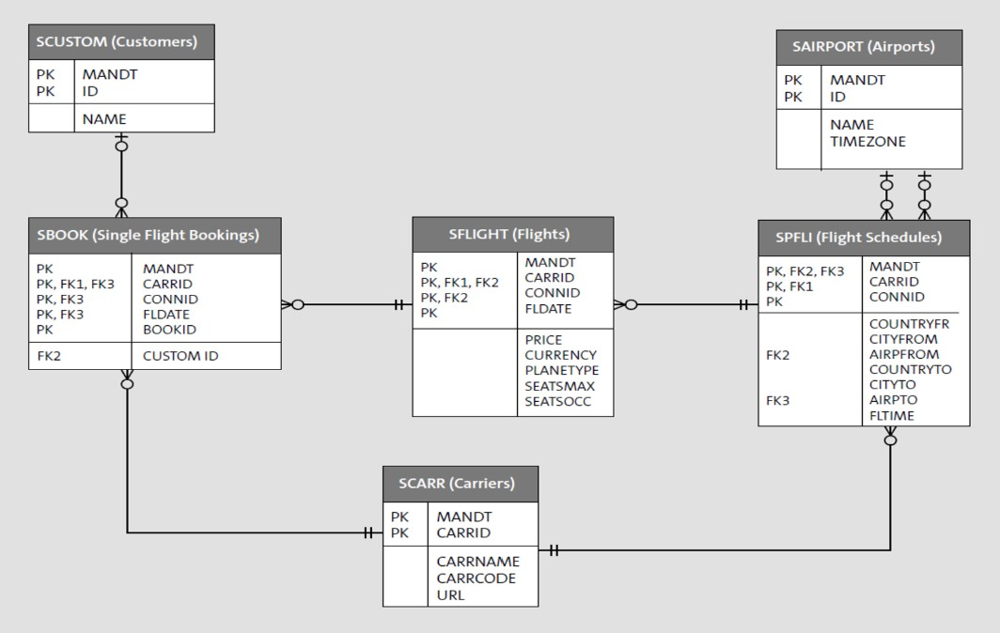

## 8. На основе работы по уроку «Взаимодействие с СУБД» необходимо:
#### Самостоятельная работа
1) Реализовать EndPoint для просмотра всех бронирований авиаперелетов. В результат вывести следующие поля:
    ```
    BOOKID
    CARRNAME
    CITYFROM
    AIRPFROM
    CITYTO
    AIRPTO
    FLTIME
    PRICE
    CURRENCY
    ```
2) Реализовать EndPoint для просмотра конкретного бронирования по BOOKID;

3) Реализовать методы POST для добавления нового бронирования и метод DELETE для удаления конкретного бронирования;

#### Самостоятельная работа 2
Результат по предыдущей задаче необходимо усовершенствовать:

1) Запросы должны работать с PyDantic-схемами;

2) Добавить авторизацию через JWT-токены. Просмотр бронирований должен быть доступен всем, а добавление и удаление только пользователям прошедшим аутентификацию;

3) Необходимо соблюсти структуру проекта.


## 7. Домашнее задание — Система бронирования авиабилетов (Flight Model)

1) Выбрать СУБД (PostgreSQL или SQLite)
2) Создать БД
3) В созданной БД создать набор таблиц, похожий на обучающий пример SAP (Бронирование авиаперелетов - SFLIGHT итп)

4) Подготовить набор случайных данных для заполнения таблиц. Использовать random и faker
5) Подготовить файлы для миграции через alembic
6) Разработать однопользовательскую систему бронирования через консоль (в консоли можно выбирать значения из списка. Присмотритесь к библиотеке prompt_toolkit). Архитектура системы должна позволять последующее превращение ее в многопользовательскую (не смешивать клиентскую и серверную часть в одном модуле)
7) Для предупреждения овербукинга проверяется количество свободных мест на рейсе. Пары рейс-количество_свободных_мест нужно кэшировать через redis
8) Написать тесты

Пользовательский сценарий:
1) Пользователь запускает приложение. Идентификация пользователя (задел на будущее, пока можно просто запросить, например, телефон как идентификатор)
2) Командная строка запрашивает город отправления
3) Командная строка запрашивает город прибытия
4) Командная строка запрашивает дату
5) Программа выводит список рейсов
6) Пользователь вводит номер рейса или отказывается от брони
7) Командная строка запрашивает данные пассажиров (пока достаточно количества)
8) Приложение проверяет свободные места в кэше. Если места есть, обновляет БД и кэш. Если мест нет, предлагает выбрать другой рейс
